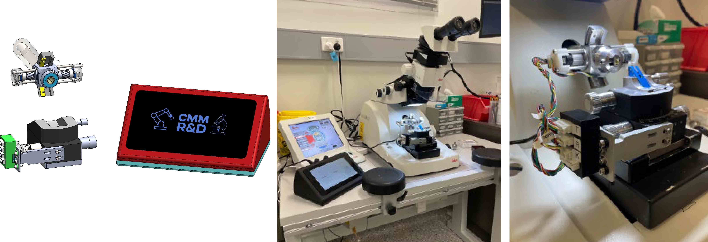

# Trimothee Ultramicrotome Targeting

This project contains resources for the Trimothee Ultramicrotome Targeting system developed at the Centre for Microscopy and Microanalysis (UQ). The repository includes software, firmware, CAD and drawings, and electronics designs.

<a href="https://cmm.centre.uq.edu.au/">
  
</a>

## Project Structure

- **src/**: Python software code (client, drivers, requirements, etc.)
- **firmware/**: Embedded/firmware code for microcontrollers
- **CAD_files/**: CAD files for mechanical design
- **electronics/**: Electronics schematics, PCB layouts, and related files
- **run_trimothee.bat / run_trimothee.sh**: Entry-point scripts for running the software

## Prerequisites
- Python 3.12 or newer is recommended
- pip (Python package installer). Some packages may not be available via Conda.
- cmm_tools (for running the Python client, see src/README.md for details). A precompiled wheel is available in src/wheels/ for easy installation.

## Installation

In a terminal (or command prompt on Windows) activate the Python environment/venv you intend to use for the project (if applicable) and navigate to the project root.

1. **Install cmm_tools package from wheel**

   Install the distributed tools package using pip with the wheel file from `src/wheels/`. From the project root, you can run:
   ```sh
   pip install src/wheels/cmm_tools-cp312-cp312-<VERSION>.whl
   ```
   replacing `<VERSION>` with the appropriate value for your platform (e.g., `linux_armv7l` for Raspberry Pi 4, or `win_amd64` for Windows 64-bit if that wheel is available).

2. **Install Python dependencies**
   ```sh
   pip install -r src/requirements.txt
   ```

## Configuration

The software configuration file `config.json` is located in the `src/` directory. Adjust this file as needed for your setup or use the default.

## Running the Software

Call the provided `run_trimothee.bat` (Windows) or `run_trimothee.sh` (Linux/Raspberry Pi) script to launch the driver and UI client.

