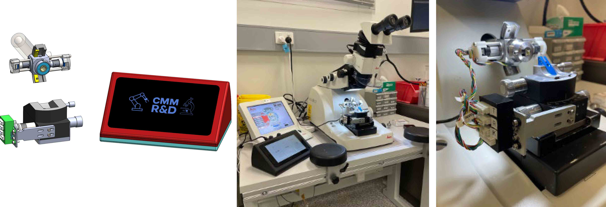

# Trimothee Ultramicrotome Targeting

This project contains resources for the Trimothee Ultramicrotome Targeting system developed at the Centre for Microscopy and Microanalysis (UQ). The repository includes software, firmware, CAD and drawings, and electronics designs.

<a href="https://cmm.centre.uq.edu.au/">
  
</a>

## Project Structure

- **src/**: Python software code (client, drivers, requirements, etc.)
- **firmware/**: Embedded/firmware code for microcontrollers
- **CAD_files/**: CAD files for mechanical design
- **electronics/**: Electronics schematics, PCB layouts, and related files
- **run_trimothee.bat** or **run_trimothee.sh**: Entry-point scripts for running the software

## Prerequisites
- The software is primarily developed and tested on Raspberry Pi OS.
- Python 3.12 is recommended
- pip (Python package installer). Some packages may not be available via Conda.
- cmm_tools (for running the Python client, see src/README.md for details). Precompiled wheels are available in src/wheels/ for easy installation.

## Installation
1. **Set up Python environment**

   Create a Python virtual environment (venv) for the project if desired. This is recommended to manage dependencies and avoid conflicts with other projects.
   ```sh
   python -m venv /path/to/your/venv
   ```

   1. **Define project environment variable(s)**
   
      Modify your shell configuration (~/.bashrc) to define environment variables for the project.
      ```sh
      nano ~/.bashrc
      ```
      Add the following line to the bottom of the .bashrc file (adjust the path to your venv bin/ path accordingly):
      ```
      export TRIMOTHEE_VENV="/path/to/your/venv/bin/folder"
      ```

   2. **Install cmm_tools package from wheel**

      In a terminal (or command prompt on Windows) activate the project venv and navigate to the project root.
      ```sh
      source $TRIMOTHEE_VENV/activate
      cd /path/to/Trimothee/base/directory
      ```

      Install the distributed tools package using pip. From the project root, you can run:
      ```sh
      pip install src/wheels/cmm_tools-cp312-cp312-<VERSION>.whl
      ```
      replacing `<VERSION>` with the appropriate value for your platform (e.g., `linux_armv7l` for Raspberry Pi 4, or `win_amd64` for Windows 64-bit if that wheel is available).

   3. **Install remaining Python dependencies**

      ```sh
      pip install -r src/requirements.txt
      ```

2. **Download project files**

   If downloading the files from GitHub, you can either clone the repository or download the ZIP file and extract it to a directory on your computer.
   The automated scripts are currently configured to run with `/home/pi/Trimothee` as the toplevel project directory. If you place the files elsewhere, you may need to adjust the configuration paths accordingly.

3. **Set up run scripts**

   On RaspberryPi/Linux, ensure the `run_trimothee.sh` script has execute permissions:
   ```sh
    chmod +x run_trimothee.sh
    ```
   For autorun, you will also need to either copy the .desktop file or create a symlink in `~/.config/autostart/`
   ```sh
   ln -s ~/Trimothee/autorun_trimothee.desktop ~/.config/autostart/trimothee.desktop
   ```
   You can also copy the .desktop file to the user Desktop for easy double-click launching.

## Configuration

The software runtime configuration file `config.json` is located in the `src/` directory. Adjust this file as needed for your setup or use the default.

## Running the Software
*RaspberryPi* - If configured correctly, the application should automatically launch on reboot.

To run manually, or on windows, you can call call the provided `run_trimothee.bat` (Windows) or `run_trimothee.sh` (Linux/Raspberry Pi) script to launch the driver and UI client.

For example, on RaspberryPi you can run directly from a terminal window within the Trimothee directory:
```sh
cd /home/pi/Trimothee
./run_trimothee.sh
```
Or on Windows, double-click the `run_trimothee.bat` file or run it from a command prompt.

